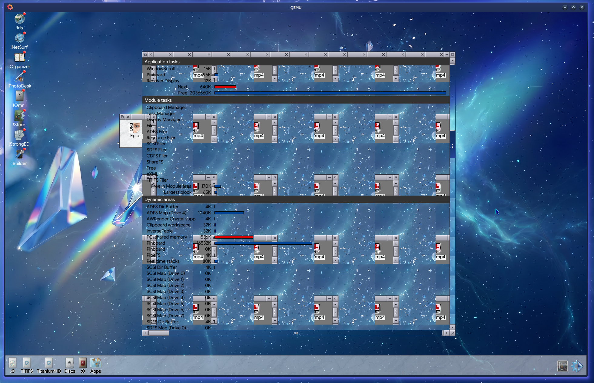

# A15 OMAP Emulator Based on Ti AM5728 and Ti HAL RISCOS 5

An emulator for the RISC OS **Dual Core A15 OMAP5** machine, based on the Texas Instruments **AM5728** SoC (dual Cortex-A15).

> **Status:** Work in progress. See [Roadmap](#roadmap) below.



*RISC OS booted to the colour desktop on the emulated AM5728, with the Task
Manager and iconbar.*

---

## Overview

This project emulates the hardware of the Dual Core A15 OMAP5 motherboard sufficiently to boot and run RISC OS. It models the AM5728 SoC peripherals, memory map, and core behaviour as a software target.

The AM5728 is a publicly documented part. All hardware facts used in this emulator — register addresses, bit-field layouts, memory maps, reset values, and peripheral behaviour — are derived from publicly available Texas Instruments sources and from observation of real hardware behaviour.

## Hardware target

| Item        | Detail                                              |
|-------------|-----------------------------------------------------|
| SoC         | Texas Instruments AM5728 (Sitara)                   |
| CPU         | 2× ARM Cortex-A15                                    |
| Machine     | Dual Core A15 OMAP5 (RISC OS)                       |
| References  | TI public AM5728 datasheet & Technical Reference Manual |

## Building

```
# TODO: fill in your build steps
```

## Running

```
# TODO: fill in invocation + ROM image instructions
```

You must supply your own RISC OS ROM image. None is distributed with this project.

## Roadmap

- [X ] CPU core (Cortex-A15)
- [ X] Memory map & DDR
- [X ] Interrupt controller (GIC)
- [ ] UART
- [ ] Timers
- [X ] Display / framebuffer
- [X ] Storage
- [ X] USB / input

## Documentation & provenance

This emulator is an **independent, clean-code-style implementation**. It is written from an understanding of how the AM5728 hardware behaves, not by transcribing any third-party document. No Copyrighted Documentation or Diagrams was Uploaded or Included during this work.

- Register and peripheral definitions are annotated, where practical, with citations to **TI's publicly available** AM5728 datasheet and Technical Reference Manual.
- No proprietary or licence-restricted documentation is reproduced, redistributed, or included in this repository — neither the documents themselves nor their text, diagrams, or tables.
- No RISC OS ROM, firmware, or other copyrighted binary is distributed here.

If you believe any content in this repository infringes your rights, please open an issue and it will be addressed promptly.

## Legal

- "RISC OS" is the property of its respective owner. This project is not affiliated with or endorsed by them.
- "Sitara" and "AM5728" are trademarks of Texas Instruments. This project is not affiliated with or endorsed by Texas Instruments.
- This is a hobby / interoperability project. Emulation of hardware for the purpose of running otherwise-licensed software is the user's responsibility. Emulation is not bound by the same rights as distrubuted documentation or an Actual Hardware Product

## License

This emulator's **source code** is licensed under the [MIT License](LICENSE)

Note: this licence applies only to the original source code in this repository. It does not grant rights to any third-party documentation, ROM images, or firmware, which are not included here.
